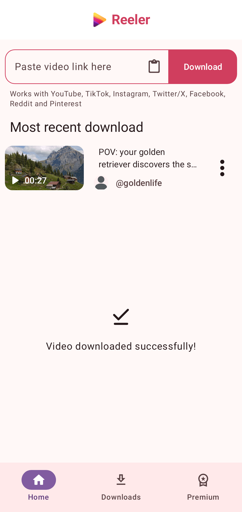
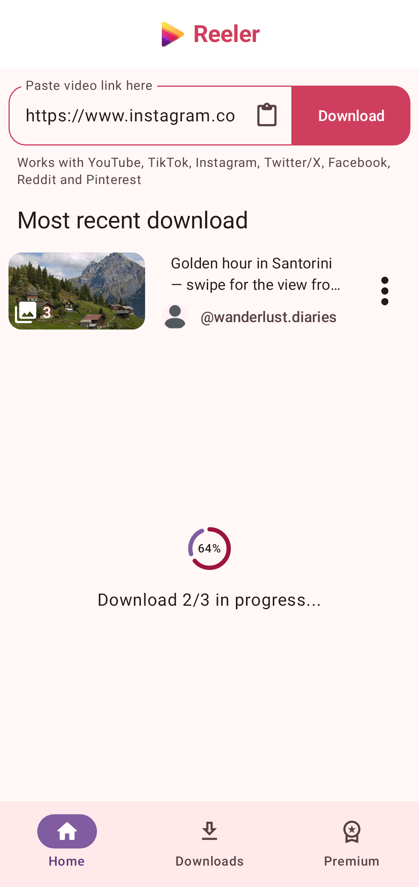
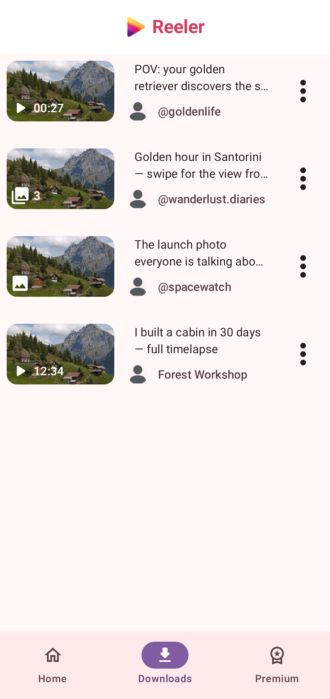
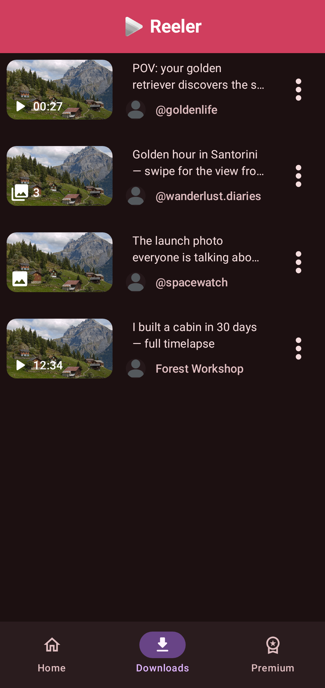
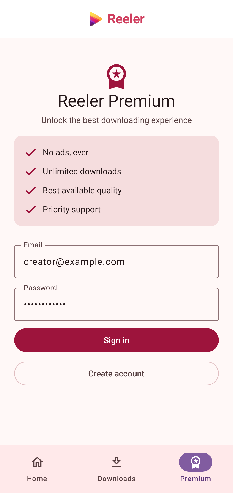
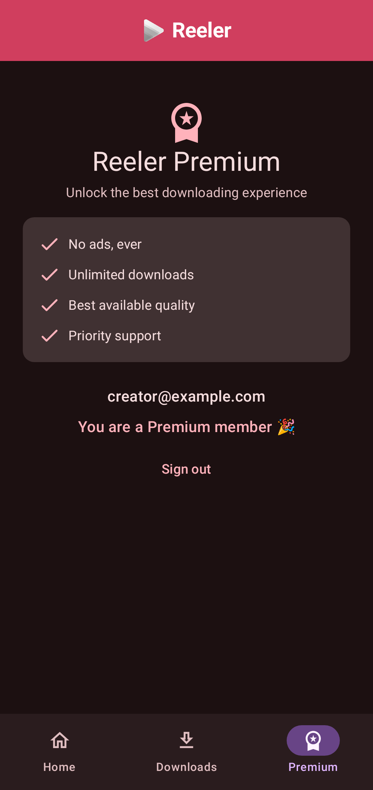

<div align="center">


# Reeler

**A native Android downloader for videos, images and carousels from all the major social platforms — no servers, no Python, pure Kotlin.**


</div>

---

Paste a link — get the media. Reeler re-implements the extraction logic of
[yt-dlp](https://github.com/yt-dlp/yt-dlp) **natively in Kotlin**, so the app
talks directly to each platform's own APIs from the device. There is no
backend, no yt-dlp binary, and nothing to keep running in the cloud.

## 📸 Screenshots

| Home | Multi-file download | Downloads |
| :--: | :--: | :--: |
|  |  |  |

| Dark theme | Premium | Premium member |
| :--: | :--: | :--: |
|  |  |  |

> Screenshots are generated straight from the app's composables with
> [Compose Preview Screenshot Testing](https://developer.android.com/studio/preview/compose-screenshot-testing)
> — run `./gradlew updateDebugScreenshotTest` to regenerate them.

## ✨ Features

- **7 platforms, one paste box** — YouTube (videos + Shorts), TikTok (videos +
  photo-mode posts), Instagram (reels, posts, carousels), Twitter/X (videos,
  GIFs, photos, multi-media tweets), Facebook (videos, reels, watch pages),
  Reddit (videos, images, galleries) and Pinterest (video + image pins).
- **Not just video** — image posts download at original resolution, and
  carousels/galleries are fetched file-by-file with per-item progress.
- **Share-to-download** — share a link from any social app straight into
  Reeler and the download starts immediately.
- **Streaming downloads** — files stream directly into MediaStore with live
  progress; a 4K video never has to fit in RAM, and half-written files never
  show up in your gallery (`IS_PENDING`).
- **Download history** — Realm-backed history with thumbnails, media-type
  badges, in-app playback (ExoPlayer) and image viewing (Coil), share,
  open-on-platform and delete.
- **Background-safe** — downloads run in a WorkManager worker with completion
  notifications, so leaving the app doesn't kill the download.
- **Premium with [Clerk](https://clerk.com)** — email/password auth with
  email-code verification; premium members get an ad-free experience
  (no banners, no interstitials).
- **Light & dark theme**, Material 3 dynamic UI, edge-to-edge.

## 🏗 How it works

```
   ┌────────────────────────────  paste / share a URL  ───────────────────────────┐
   │                                                                              │
   ▼                                                                              │
 MediaInfoExtractor ──▶ ExtractorRegistry ──▶ InstagramExtractor / TiktokExtractor│
   (URL pattern match)                        TwitterExtractor / YoutubeExtractor │
                                              FacebookExtractor / RedditExtractor │
                                              PinterestExtractor                  │
   │                                                                              │
   ▼  MediaInfoExtraction (caption, author, thumbnail, N downloadable files)      │
 DownloadWorker (WorkManager) ──▶ MediaDataFetcher ──▶ ReelerMediaService         │
   status → LiveData → Compose UI   (streaming Ktor)    (MediaStore: Movies/Pics) │
   └──────────────────────────────────────────────────────────────────────────────┘
```

Each platform implements one small interface, in the spirit of yt-dlp's
`InfoExtractor`:

```kotlin
interface Extractor {
    val name: String                 // "instagram"
    val urlPattern: Regex            // decides which URLs it handles
    suspend fun extract(url: String): MediaInfoExtraction
}
```

Adding a platform = one object + one line in the registry. Extractors share a
single Ktor `HttpClient` and return a `MediaInfoExtraction` that can describe
a single video, a single image, or a carousel of mixed media.

## 🛠 Tech stack

| Layer | Choice |
| --- | --- |
| UI | Jetpack Compose, Material 3, Navigation Compose (type-safe routes) |
| Architecture | MVVM, Hilt DI, Kotlin Coroutines + Flow |
| Networking | Ktor client (CIO) + kotlinx.serialization |
| Media | ExoPlayer (Media3), Coil, MediaStore API |
| Persistence | Realm Kotlin |
| Background work | WorkManager (Hilt-injected `CoroutineWorker`) |
| Auth / Premium | Clerk Android SDK |
| Monetization | AdMob (banner + interstitial), disabled for premium users |
| QA | JUnit extractor tests, Compose Preview screenshot tests |

## 🚀 Building

Requirements: **JDK 17** and an Android SDK (platform 36).

```sh
cd mobile
./gradlew :app:assembleDebug        # debug APK
./gradlew :app:assembleRelease      # minified R8 release
./gradlew :app:testDebugUnitTest    # live extractor tests
```

If Gradle picks up the wrong Java, point it at a JDK 17 with
`JAVA_HOME=/path/to/jdk17` or `org.gradle.java.home` in
`~/.gradle/gradle.properties`.

### Enabling premium (optional)

The app runs fully without configuration (the Premium tab shows "Coming
soon"). To enable it, add to `~/.gradle/gradle.properties`:

```properties
clerkPublishableKey=pk_test_xxx                         # Clerk dashboard → API keys
premiumCheckoutUrl=https://accounts.your-app.dev/user   # optional billing page
```

A signed-in user becomes premium when their Clerk account has
`"premium": true` in **public metadata** — set it from the Clerk dashboard or
a billing webhook.

## 📁 Repository layout

```
mobile/                          # the Android app
  app/src/main/java/com/catalinalabs/reeler/
    logic/                       # extraction engine
      core/                      #   Extractor interface, registry plumbing, shared HttpClient
      instagram/ tiktok/ ...     #   one package per platform
    services/                    # DownloadWorker, MediaStore, notifications, ads, Clerk
    data/                        # Realm schema + repository
    ui/                          # Compose screens, components, view models
  app/src/screenshotTest/        # portfolio screenshots, rendered from composables
workers/                         # legacy server-side experiments (unused by the app)
```

## ⚖️ Disclaimer

Reeler is a technical showcase. Downloading content may violate the terms of
service of the platforms involved — only download media you own or have
permission to save, and respect creators' rights.
